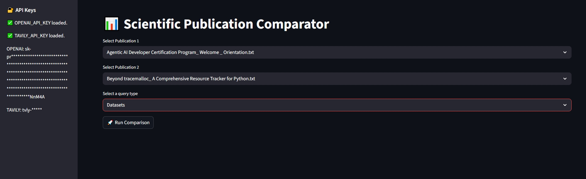

# **Agentic AI Developer Certification: LangGraph-Orchestrated Research Assistant for Ready Tensor**


### **Tags:** AAIDC2025 · AAIDC‑M2 · Agentic AI · Certification Program · Chain-of-Thought · Document Assistant · LangChain · LangGraph · Question-Answering (QA) · Retrieval‑Augmented Generation (RAG) · ReAct · Vector Databases
### **Co‑Authors:** chibueze.k.muoneke@gmail.com, michelaagostini73@gmail.com
### **Models & Code:** [GitHub Repository](https://github.com/micag2025/Agentic_AI_Developer_Certification_Project2)
### **Dataset:** [project_1_publications.json]((https://drive.google.com/drive/folders/1HAqLXL2W-sh8hqoBb1iSauJ_0wZVRxB9)) 
---

## TL;DR

The **LangGraph‑Orchestrated Research Assistant** is a Streamlit‑based web application designed for side‑by‑side comparison of scientific publications drawn from the Ready Tensor dataset. Leveraging LangChain, LangGraph agents, and the OpenAI API, the system automates:

* Extraction of key publication attributes (tools, datasets, evaluation metrics, results)
* Side‑by‑side profiling and trend aggregation
* Fact‑checking against original text
* Contextual enrichment via external search (Tavily)
* Visualization of orchestration logic through Mermaid and Graphviz flowcharts

This modular, secure pipeline facilitates rapid document comparison, summarization, and enrichment, ideal for Ready Tensor users, developers, and enterprise research teams.

---

## Tool Overview & Architecture

The application is built on a **modular LangChain + LangGraph pipeline**, orchestrated as follows:

1. **Publication Ingestion**

   * **Loader:** Parses `project_1_publications.json` into individual `.txt` files
   * **Preprocessor:** Cleans and normalizes text (titles → filenames, preserves structure)

2. **Vectorization & Storage**

   * **Embeddings:** OpenAI embeddings via LangChain
   * **Vector DB:** Chroma for fast semantic retrieval

3. **Agent‑Based Analysis (LangGraph)**

   * **Orchestration Agent:** A LangGraph state‑machine that routes tasks to specialized nodes
   * **Profile Extraction Node:** GPT‑powered extraction of tools, datasets, metrics, tasks, results
   * **Comparison Engine Node:** Aligns two publication profiles for side‑by‑side analysis
   * **Trend Aggregator Node:** Detects evolving patterns across methods or results
   * **Fact‑Checking Node:** Cross‑verifies generated insights with source text
   * **Enrichment Node:** ReAct agent performing Tavily web searches for external context

4. **Visualization Layer**

   * **Streamlit UI:** Interactive sidebar for publication selection and query input
   * **Flowchart Generation:**

     * **Mermaid:** Outputs `.mmd` flow definitions
     * **Graphviz:** Produces PNG diagrams of the orchestration graph

5. **Security & Environment**

   * **Secrets Management:** `.env` for `OPENAI_API_KEY` & `TAVILY_API_KEY`
   * **Git Hygiene:** Preconfigured `.gitignore` to exclude secrets and outputs

---

## Key Features

### 1. Data Processing

* **Unified Loader:** Ingests `.json` of publications → individual `.txt` files
* **Structured Preprocessing:** Title sanitization, metadata preservation
* **Secure Paths:** `paths.py` centralizes directory structure for cross‑platform use

### 2. Analysis Pipeline

* **LangGraph Orchestration:** Agent‑driven, stateful workflow management
* **Profile Extraction:** Automated GPT extraction of publication metadata
* **Side‑by‑Side Comparison:** Query‑driven alignment of two publication profiles
* **Trend Aggregation:** Automatic detection of method/result trends across publications
* **Fact‑Checking:** Ensures accuracy against source documents
* **ReAct Enrichment:** External web context via Tavily search

### 3. Visualization & Export

* **Interactive Streamlit UI:**

  * Dropdown selectors for Publication A & Publication B
  * Query input (e.g., “Evaluation Methods”, “Datasets used”)
  * Display of comparison tables, trend charts, and enrichment notes
* **Flowchart Outputs:**

  * **Mermaid (.mmd)** for in‑doc embedding
  * **Graphviz (PNG)** for reports and CI pipelines
* **Export Formats:** HTML / JSON of comparison results for downstream use

---

## Repository Structure

```
Agentic_AI_Developer_Certification_Project2/
├── app.py                         # Streamlit entry point
├── explorer.py                    # LangGraph orchestration logic
├── loader.py                      # JSON → .txt converter
├── paths.py                       # Central path definitions
├── generate_langgraph_mermaid.py  # Mermaid diagram generator
├── generate_graphviz_flowchart.py # Graphviz diagram generator
├── utils.py                       # Helper functions
├── data/
│   └── project_1_publications.json
│   └── sample_publications/
│      └── <publication>.txt
├── requirements.txt
├── .env.example
├── .gitignore
├── LICENSE
├── outputs/
│   ├── comparison_pub1_vs_pub2.html
│   └── comparison_pub1_vs_pub2.json
├── docs/
│   ├── publication_flowchart.png
│   └── langgraph_flowchart.mmd
└── examples_screenshots/
    └── streamlit_comparison.jpeg
```

---

## Prerequisites

* **Python 3.10+**
* **Environment Variables:**

  * `OPENAI_API_KEY` (OpenAI)
  * `TAVILY_API_KEY` (Tavily for external searches)

---

## Installation

1. **Clone & Checkout**

   ```bash
   git clone https://github.com/Joshua-Abok/Agentic-AI-Developer-Certification-Project2
   cd Agentic-AI-Developer-Certification-Project2
   git checkout main
   ```
2. **Virtual Environment (recommended)**

   ```bash
   python3 -m venv .venv
   source .venv/bin/activate    # macOS/Linux
   .\.venv\Scripts\activate   # Windows
   ```
3. **Install Dependencies**

   ```bash
   pip install -r requirements.txt
   ```
4. **Configure Environment**
   Copy `.env.example` → `.env` and populate:

   ```env
   OPENAI_API_KEY=your_openai_key
   TAVILY_API_KEY=your_tavily_key
   ```

---

## Running the Application

1. **Ensure Data**
   Confirm `data/project_1_publications.json` is present.
2. **Launch Streamlit**

   ```bash
   streamlit run app.py
   ```
3. **Open in Browser**
   Navigate to `http://localhost:8501` to access the Research Assistant.

---

## Usage Examples

1. **Select Publications**
   Choose two publications from the dropdown menus.

2. **Enter a Query**
   E.g., “Evaluation Methods” or “Dataset comparisons”.

3. **View Results**

   * Side‑by‑side comparison table of extracted profiles
   * Trend aggregation chart
   * Fact‑checking annotations
   * Enrichment insights sourced from external web search

4. **Inspect Orchestration**
   Click “View Flowchart” in the sidebar to see the LangGraph diagram.

---

## Contributing

We welcome enhancements and issue reports:

1. **Fork** the repo
2. **Create** a feature branch (`git checkout -b feature-name`)
3. **Commit & Push** your changes
4. **Submit** a Pull Request

Please adhere to existing code style and update documentation as needed.

---

## License

Licensed under the [MIT License](LICENSE).

---

## Acknowledgments

This work is part of the **Agentic AI Developer Certification** program by [Ready Tensor](https://www.readytensor.ai). Special thanks to the Ready Tensor developer community for guidance and feedback.
