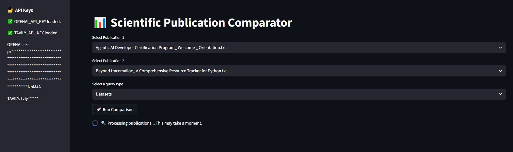

# **Agentic AI Developer Certification: LangGraph-Orchestrated Research Assistant for Ready Tensor**


### **Tags:** AAIDC2025 · AAIDC‑M2 · Agentic AI · Certification Program · Chain-of-Thought · Document Assistant · LangChain · LangGraph · Question-Answering (QA) · Retrieval‑Augmented Generation (RAG) · ReAct · Vector Databases
### **Co‑Authors:** chibueze.k.muoneke@gmail.com, michelaagostini73@gmail.com
### **Models & Code:** [GitHub Repository](https://github.com/micag2025/Agentic_AI_Developer_Certification_Project2)
### **Dataset:** [project_1_publications.json]((https://drive.google.com/drive/folders/1HAqLXL2W-sh8hqoBb1iSauJ_0wZVRxB9)) 
---

## TL;DR

The **LangGraph‑Orchestrated Research Assistant** is a Streamlit‑based web application designed for side‑by‑side comparison of scientific publications drawn from the Ready Tensor dataset. Leveraging LangChain, LangGraph agents, and the OpenAI API, the system automates:

* Extraction of key publication attributes (tools, datasets, evaluation metrics, results)
* Side‑by‑side profiling and trend aggregation
* Fact‑checking against original text
* Contextual enrichment via external search (Tavily)
* Visualization of orchestration logic through Mermaid and Graphviz flowcharts

---

## Tool Overview & Architecture

### System Architecture Goals

The assistant leverages cutting-edge technologies to create a robust and scalable solution. LangChain and LangGraph together provide an orchestration framework for a multi-agent RAG pipeline, supporting document ingestion, intelligent querying, agent routing, and structured output generation. OpenAI embeddings and Chroma vector storage enable fast semantic retrieval, while ReAct-style external enrichment ensures access to up-to-date information.

The system is grounded in five primary architectural goals:

### 1. Robust Data Ingestion Pipeline

* **Publication Loader** parses `project_1_publications.json` into clean, structured `.txt` files.
* Metadata is preserved while filenames are sanitized for consistency.
* Preprocessing includes normalization, structure preservation, and integrity validation.

### 2. Efficient Vector Storage & Retrieval

* OpenAI-generated embeddings are stored and retrieved using **Chroma**, a high-performance vector database.
* Index creation and persistence are optimized for fast semantic search operations.

### 3. Multi-Agent Orchestration & Reasoning (LangGraph)

* Built around a **LangGraph** state machine that routes queries to multiple specialized agents:

  * **Profile Extraction Agent**: Identifies tools, datasets, metrics, and results from publications.
  * **Comparison Engine Agent**: Aligns and contrasts attributes across two documents.
  * **Trend Aggregator Agent**: Detects cross-publication patterns and method trends.
  * **Fact-Checker Agent**: Verifies information consistency with source texts.
  * **Enrichment Agent**: Uses **ReAct** strategy with **Tavily** search to add real-world context.

### 4. Visualization and Interaction Layer

* **Streamlit** provides a responsive user interface:

  * Dropdown selectors for publications
  * Query input area for comparison topics
  * Output panels for structured responses
* Orchestration diagrams:

  * **Mermaid** outputs `.mmd` files for doc embedding
  * **Graphviz** generates PNG flowcharts for documentation and presentations

### 5. Secure and Configurable Development Environment

* Environment configuration managed through `.env` file:

  * `OPENAI_API_KEY`, `TAVILY_API_KEY` safely handled
* `.gitignore` ensures secrets, logs, and large outputs are excluded from version control

### Workflow
The flowchart below illustrates the system's LangGraph-driven orchestration logic:

* Two publications are selected from the Ready Tensor dataset.
* Each publication is analyzed independently to extract relevant metadata.
* A comparison agent aligns and contrasts their content.
* Aggregated trends are generated from the analysis.
* A summarization step compiles key findings.
* A fact-checking node validates the results against the source documents.
* The workflow terminates with a structured response ready for user presentation.


---

## Key Features

### 1. Data Processing

* **Unified Loader:** Ingests `.json` of publications → individual `.txt` files
* **Structured Preprocessing:** Title sanitization, metadata preservation
* **Secure Paths:** `paths.py` centralizes directory structure for cross‑platform use

### 2. Analysis Pipeline

* **LangGraph Orchestration:** Agent‑driven, stateful workflow management
* **Profile Extraction:** Automated GPT extraction of publication metadata
* **Side‑by‑Side Comparison:** Query‑driven alignment of two publication profiles
* **Trend Aggregation:** Automatic detection of method/result trends across publications
* **Fact‑Checking:** Ensures accuracy against source documents
* **ReAct Enrichment:** External web context via Tavily search

### 3. Visualization & Export

* **Interactive Streamlit UI:**

  * Dropdown selectors for Publication A & Publication B
  * Query input (e.g., “Evaluation Methods”, “Datasets used”)
  * Display of comparison tables, trend charts, and enrichment notes
* **Flowchart Outputs:**

  * **Mermaid (.mmd)** for in‑doc embedding
  * **Graphviz (PNG)** for reports and CI pipelines
* **Export Formats:** HTML / JSON of comparison results for downstream use

---

## Repository Structure

```
Agentic_AI_Developer_Certification_Project2/
├── src/
│   ├── app.py                         # Main Streamlit App UI (entry point for the web interface)
│   ├── explorer.py                    # Core logic for publication analysis using LangGraph and LLMs
│   ├── generate_flowchart_graphviz.py # Generates a Graphviz PNG diagram of the LangGraph orchestration flow
│   ├── generate_flowchart_mermaid.py  # Generates a Mermaid diagram of the LangGraph orchestration flow
│   ├── loader.py                      # Converts JSON into individual .txt files from the Sample Ready Tensor dataset
│   ├── paths.py                       # Centralized path definitions
│   ├── utils.py                       # Helper functions for path and string handling
├── .env.example                      # Example environment file storing secret API keys
├── data/                      
│   ├── project_1_publications.json   # Sample Ready Tensor dataset
│   └── sample_publications/          # Directory containing input publication `.txt` files
│       └── <publication .txt>        # ↳ Each text file represents a single publication
├── requirements.txt                  # Dependency list for pip install (Streamlit, LangChain, etc.)
├── README.md                         # Project documentation explaining setup and usage
├── .gitignore                        # Specifies files/folders to be ignored by Git
├── LICENCE                           # Project license file
├── outputs/                          
│   ├── <comparison publ1 vs publ2 .html> # ↳ HTML output of comparisons
│   └── <comparison publ1 vs publ2 .json> # ↳ JSON output of comparisons
├── docs/
│   ├── publication_flowchart.png         # ↳ Graphviz diagram (PNG)
│   ├── langgraph_flowchart.mmd           # ↳ Mermaid diagram (MMD)
│   └── Untitled diagram _ Mermaid Chart-2025-07-09-115351.png # ↳ Mermaid diagram (PNG)
├── examples_screens/
│   └── <screenshot .jpeg>                # ↳ UI usage screenshots
```

---

## Prerequisites

* **Python 3.10+**
* **Environment Variables:**

  * `OPENAI_API_KEY` (OpenAI)
  * `TAVILY_API_KEY` (Tavily for external searches)

---

## Installation

1. **Clone & Checkout**

   ```bash
   git clone https://github.com/micag2025/Agentic_AI_Developer_Certification_Project2
   cd Agentic-AI-Developer-Certification-Project2
   git checkout main
   ```
2. **Virtual Environment (recommended)**

   ```bash
   python3 -m venv .venv
   source .venv/bin/activate    # macOS/Linux
   .\.venv\Scripts\activate   # Windows
   ```
3. **Install Dependencies**

   ```bash
   pip install -r requirements.txt
   ```
4. **Configure Environment**
   Copy `.env.example` → `.env` and populate:

   ```env
   OPENAI_API_KEY=your_openai_key
   TAVILY_API_KEY=your_tavily_key
   ```

---

## Running the Application

1. **Ensure Data**
   Confirm `data/project_1_publications.json` is present.
2. **Launch Streamlit**

   ```bash
   streamlit run src/app.py
   ```
3. **Open in Browser**
   Navigate to `http://localhost:8501` to access the Research Assistant.


---

## Usage Examples

1. **Select Publications**
   Choose two publications from the dropdown menus.

2. **Enter a Query**
   E.g., “Evaluation Methods” or “Dataset comparisons”.

3. **View Results**

   * Side‑by‑side comparison table of extracted profiles


   * Fact‑checking annotations


   * Enrichment insights sourced from external web search


**Overall final output**


---


## References
- [LangGraph](https://www.langchain.com/langgraph)
- [LangChain](https://www.langchain.com/langchain)                 
- [Openai API](https://huggingface.co/learn/agents-course/unit2/langgraph/introduction?utm_source=chatgpt.com)
- [Streamlit](https://docs.streamlit.io/)
- [Tavily](https://www.tavily.com/)
- [Mermaid] (https://mermaid.js.org/)
- [Ready Tensor Certifications](https://app.readytensor.ai/hubs/ready_tensor_certifications)
- [Technical Evaluation Rubric](https://app.readytensor.ai/publications/WsaE5uxLBqnH)
- [Engage and Inspire: Best Practices for Publishing on Ready Tensor](https://app.readytensor.ai/publications/engage_and_inspire_best_practices_for_publishing_on_ready_tensor_SBgkOyUsP8qQ)


## Contributing

We welcome enhancements and issue reports:

1. **Fork** the repo
2. **Create** a feature branch (`git checkout -b feature-name`)
3. **Commit & Push** your changes
4. **Submit** a Pull Request

Please adhere to existing code style and update documentation as needed.

---


## Future Implementations

We welcome contributors to propose and build enhancements to this system. Some of the upcoming or potential future features include:

* **Prompt Engineering Enhancements:** Design more precise and instructive prompts using structured formats, few-shot examples, and task-specific templates to improve agent performance.

* **Multi-Query Support:** Enable users to submit multiple queries simultaneously (e.g., "Tool Usage", "Task Types") for more efficient comparative analysis.

* **Expanded Agent Toolkit & Visualizations:** Integrate additional agent tools (e.g., citation extractors, figure summarizers) and visual representations (charts, relationship graphs) to provide deeper analytical insights.

* **Advanced UI/UX Overhaul:** Build a more responsive and intuitive user interface with enhanced interactivity, visualization panels, and accessibility features.

* **LLM Fine-Tuning Integration:** Incorporate fine-tuned or domain-adapted LLMs for improved accuracy in extraction, summarization, and reasoning tasks.

* **Feedback & Evaluation Mechanisms:** Implement user rating and feedback forms for each response to continuously fine-tune performance and relevance.

Contributors are encouraged to fork the repository, submit pull requests, or open discussions for feature suggestions and design proposals. For bug reports or feature requests, [open an issue](https://github.com/micag2025/Agentic_AI_Developer_Certification_Project2/issues). For general questions or share your thoughts, start a [comment](https://app.readytensor.ai/publications/IQBETLgAsJ9X).


## License

Licensed under the [MIT License](LICENSE).

---

## Acknowledgments

This work is part of the **Agentic AI Developer Certification** program by [Ready Tensor](https://www.readytensor.ai). Special thanks to the Ready Tensor developer community for guidance and feedback.
